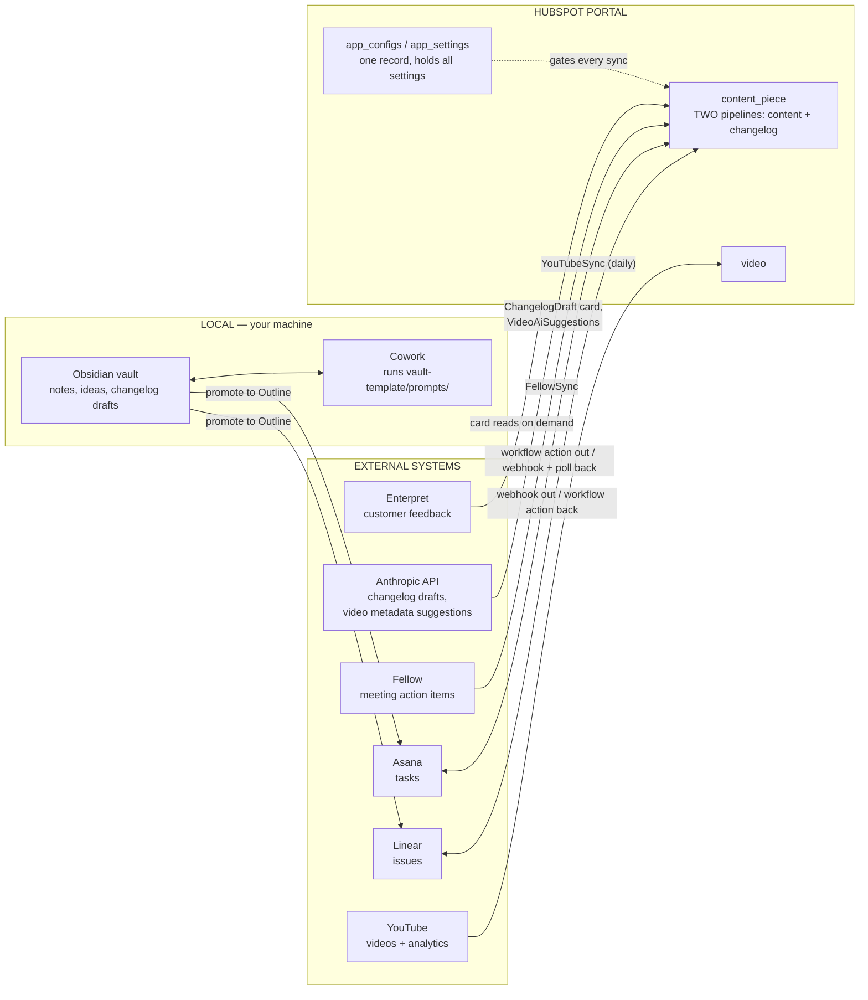
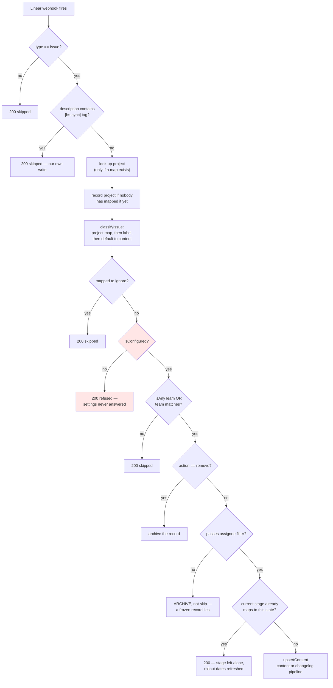
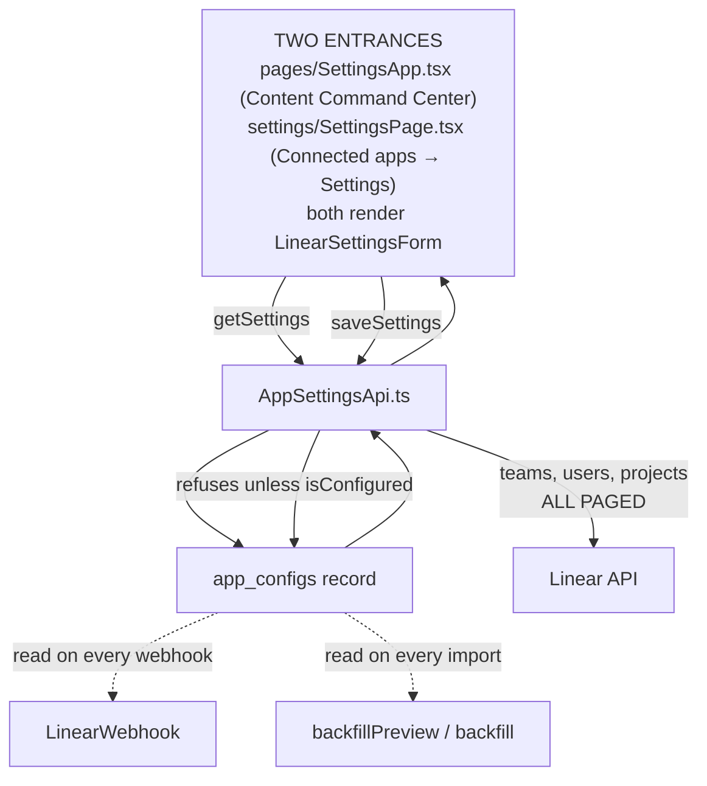
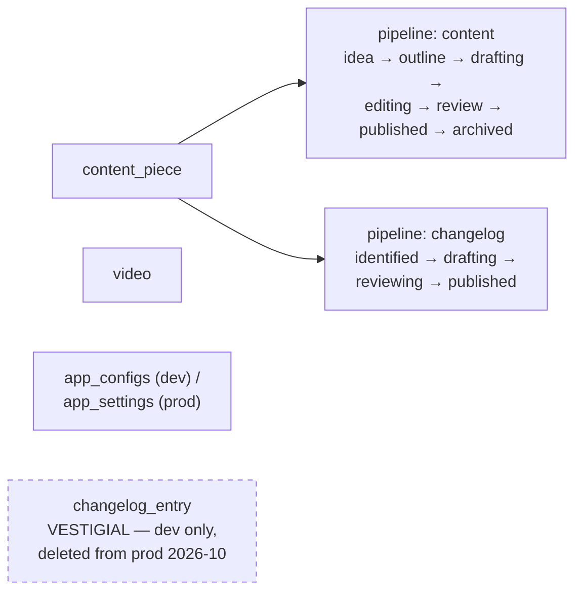
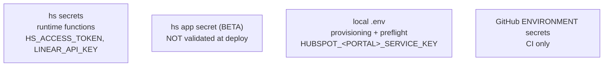

# Architecture

How the Central Brain fits together. Read this before changing sync behaviour —
most of the bugs in this repo's history came from not knowing which component
owned a decision.

GitHub renders the diagrams below. Both machines see this file because it is
checked in; nothing here lives in a chat window or a local note.

---

## 1. The whole system

**The rule that matters:** a note becomes an Outline before anything leaves
your machine. Ideas stay local. Promotion to Outline is the single threshold
that creates both the Linear issue and the Asana task.

---

## 2. Linear → HubSpot (the path that writes records)

This is the flow that once created 34 unwanted records on production. Every
guard below exists because something got through.

**`isConfigured` is checked before the team filter, and that order is load-bearing.**
The team filter fails open — an empty team id skips it — so an unconfigured
portal accepted every team until the gate above it existed.

**Excluded issues are archived, not skipped.** Skipping leaves the HubSpot
record frozen at its last synced stage: still in the pipeline, looking live, no
longer tracking anything, returning 200 the whole time.

**The stage-match skip is no longer a bare return.** It protects the *stage*,
which is all it was ever for, but a description edit can move a rollout
milestone while the issue sits in one state throughout. Since PR #108 that
branch calls `refreshDerivedProperties` and answers
`{"skipped":true,"reason":"stage already matches","refreshed":true}`. Before
that, adding a date to an existing issue produced no write and the pipeline
board kept sorting on the old one.

### Rollout milestone dates

`notes` carries the Linear issue description, which for rollout issues is a
structured template with a `### Timeline` block. `rolloutProperties` in
`src/app/lib/changelog-source.ts` parses it into `rollout_private_beta_date`,
`rollout_public_beta_date`, `rollout_live_date`, and the sort key
`rollout_priority_date` / `rollout_priority_stage` — the next milestone that
forces action. Two rules are load-bearing:

- **`1970-01-01` is not a date.** An unset HubSpot date comes back as epoch
  zero. Measured on production: 23 of 70 changelog records carry a `### Timeline`
  block, and 10 of those 23 hold `1970-01-01`. Sorting
  ascending without excluding it puts the unset records first.
- **No milestone at all means write nothing.** `rolloutProperties` returns
  `null` rather than a set of empty strings, so a date typed into HubSpot by
  hand survives a sync. Once the notes *do* carry a milestone, Linear is
  authoritative and every key is written, `''` included — that is what clears a
  milestone removed upstream. PRs #105, #108, #109.

`rollout_priority_upcoming` is deliberately **not** stored: it is relative to
today, so a stored copy is right for one day. `ContentDataApi` computes it at
read time, and `SettingsApp.tsx` orders each pipeline column by it.

---

## 3. Settings — one record gates everything

Stored on the single `app_configs` record:

| property | notes |
|---|---|
| `linear_team_id` | **primary display property** — HubSpot will not let it be cleared, so "any team" is the sentinel string `'any'`, never `''`. Always read it through `isAnyTeam()`. |
| `assignee_filter` | `all` \| `assigned` \| `mine` |
| `linear_assignee_id` | required when the filter is `mine` |
| `linear_project_map` | `{ projectId: 'content' \| 'changelog' \| 'ignore' }` |
| `linear_unmapped_projects` | projects seen in the wild that nobody has routed yet; drives the banner |
| `changelog_prompt_standalone`, `changelog_prompt_rollup` | per-portal overrides for the drafting prompts. Empty means "use the shipped default", so a portal that has not deliberately customised its wording keeps receiving improvements |
| `changelog_model`, `changelog_thinking` | which model drafts, and whether it thinks first. Empty means the defaults in `changelog-model.ts` — Sonnet, thinking off |

### The settings surface, and why the form exists twice

This section said until 2026-10-01 that `SettingsApp.tsx` was the only settings
page and that a `type: "settings"` component "renders nowhere for this private
app." **That was a correct reading of the portal on 2026-09-29 and is now
wrong.** The app's entry under Connected apps showed Overview and Insights with
no Settings tab; it now shows **Overview / Settings / App cards**, and a probe
carrying nothing but a success alert (PR #100) rendered there. The platform
changed, not the configuration — the hsmeta was byte-for-byte the documented
shape the whole time. Issue #88 asked the question; PRs #100–#102 answered it.

So there are two entrances, and exactly one implementation:

| File | Role |
|---|---|
| `src/app/pages/LinearSettingsForm.tsx` | the form. **The only copy anyone edits** |
| `src/app/pages/SettingsApp.tsx` | Content Command Center page — renders the form with a Back link |
| `src/app/settings/SettingsPage.tsx` | the Settings tab — renders the form with no Back link, because a destination is not a detour |
| `src/app/settings/LinearSettingsForm.tsx` | **generated.** `npm run sync:settings-form` writes it, `npm run build` runs that first, and `settings-form-in-sync.test.ts` fails while the two differ |

The copy is not a lapse. HubSpot bundles each extension directory in isolation:
the upload moves one directory to its own temp root and resolves from there, so
`../pages/LinearSettingsForm.tsx` cannot resolve and neither could a shared
`../lib` module. Sharing by import is unavailable, so the file has to exist in
both places. What made the 2026-09-29 duplication harmful was that *both copies
were editable* and nothing noticed when they diverged — three changes landed in
the invisible one. A copy that cannot silently drift is a different thing.

`PageTitle` comes from `@hubspot/ui-extensions/pages`, a pages-only subpath, so
the shared form must not import it. Each entrance renders its own chrome.

---

## 4. The data model

**A changelog is content.** It lives on `content_piece` in a second pipeline,
not in its own object — separate objects meant duplicate properties, duplicate
associations and routing complexity for no benefit. The workflow actions
distinguish the two with an `objectType: 'content' | 'changelog'` input field,
never by which HubSpot object they were called from.

`changelog_entry` was the leftover from before that consolidation, holding zero
records on both portals. **It has been deleted from prod (22047910).** Dev still
carries it (`2-67505888`); `provision-asana-property.ts` already treats its
absence as the expected state, so nothing breaks either way. Do not build on it.
Portal state here is operator-reported as of 2026-10-02 — this machine cannot
reach either portal.

---

## 5. What runs on a schedule, and what does not

| Thing | Trigger | Reality |
|---|---|---|
| `YouTubeSync` | `youtube-sync.yml`, GitHub Actions cron `0 9 * * *` | genuinely daily, but **dev only** — the job's `portal` input defaults to `51869810` and nothing passes prod |
| `app-health` | `credential-health.yml`, cron `0 13 * * *`, both portals | on `master` and active since 2026-10-01. No scheduled run has been observed yet (checked 2026-10-02 14:29 UTC). GitHub delays this repo's crons by hours — `youtube-sync`'s 09:00 cron has been firing around 15:30 — so absence here is not yet evidence of a fault |
| "(Daily)" HubSpot workflows | `enrollmentSchedule` | genuinely daily at 17:00 — verified on dev. But the schedule is **set by hand in the UI**, not provisioned: a new portal gets the workflow without one |
| `AsanaPoll` | workflow action | pull-based, because Asana webhooks proved unreliable |
| `LinearWebhook` | Linear push | real-time |
| Deploys | merge to `develop` → Dev, `master` → Prod | see the deploy traps in `CLAUDE.md` |

**`app-health` is the only check that would notice a dead credential.**
`npm run preflight` is entirely structural — object ids, pipelines, stages,
properties — and a revoked key passes every one of its checks. Three
credentials have died silently here: the HubSpot service key (a day to
diagnose), the YouTube refresh token, and `ANTHROPIC_API_KEY`, which was
invalid in `.env` and on both portals at once. The probes run *inside the app*,
because the credentials live in four separate homes (§6) and validating a copy
in CI proves nothing about the one the running functions use.

---

## 6. Credentials — four separate homes

Getting these confused has cost more time than any bug in the app.

A GitHub **environment** secret is invisible to a job that does not declare
`environment:` — `secrets.X` then resolves to an empty string rather than
failing. Rotating a key in one home does not rotate it in the others;
`npm run preflight` prints a key fingerprint so you can tell which one a portal
is actually using.
