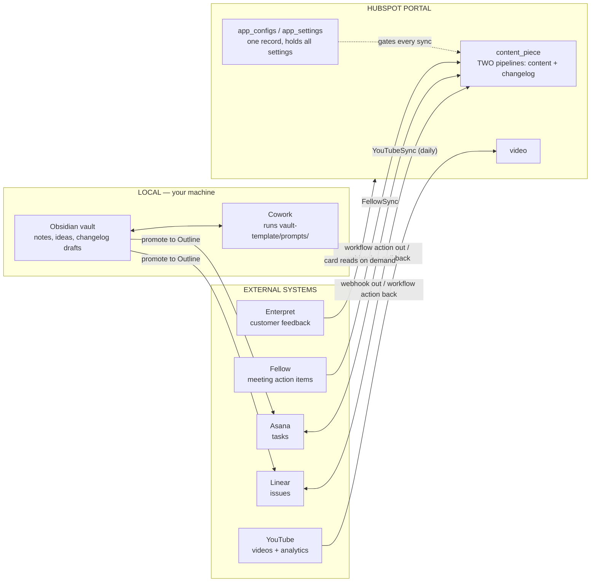
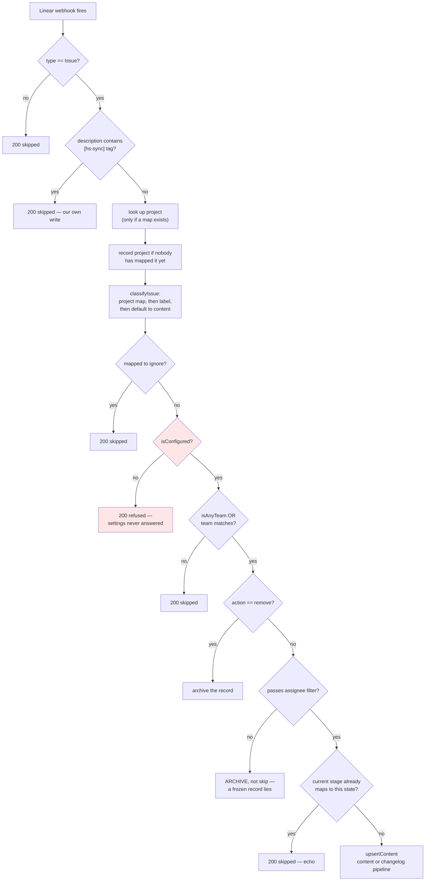
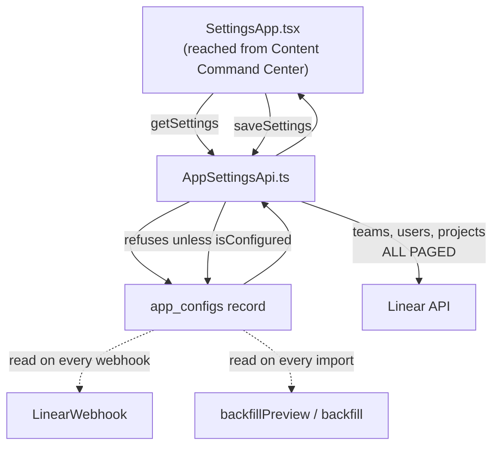
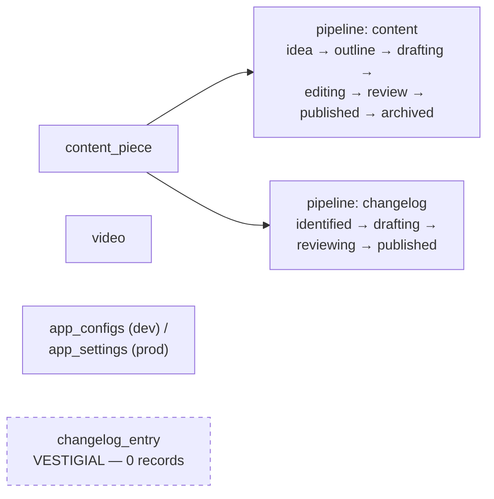
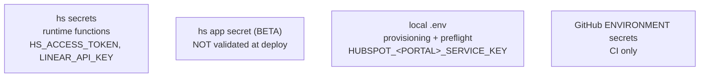

# Architecture

How the Central Brain fits together. Read this before changing sync behaviour —
most of the bugs in this repo's history came from not knowing which component
owned a decision.

GitHub renders the diagrams below. Both machines see this file because it is
checked in; nothing here lives in a chat window or a local note.

---

## 1. The whole system

**The rule that matters:** a note becomes an Outline before anything leaves
your machine. Ideas stay local. Promotion to Outline is the single threshold
that creates both the Linear issue and the Asana task.

---

## 2. Linear → HubSpot (the path that writes records)

This is the flow that once created 34 unwanted records on production. Every
guard below exists because something got through.

**`isConfigured` is checked before the team filter, and that order is load-bearing.**
The team filter fails open — an empty team id skips it — so an unconfigured
portal accepted every team until the gate above it existed.

**Excluded issues are archived, not skipped.** Skipping leaves the HubSpot
record frozen at its last synced stage: still in the pipeline, looking live, no
longer tracking anything, returning 200 the whole time.

---

## 3. Settings — one record gates everything

Stored on the single `app_configs` record:

| property | notes |
|---|---|
| `linear_team_id` | **primary display property** — HubSpot will not let it be cleared, so "any team" is the sentinel string `'any'`, never `''`. Always read it through `isAnyTeam()`. |
| `assignee_filter` | `all` \| `assigned` \| `mine` |
| `linear_assignee_id` | required when the filter is `mine` |
| `linear_project_map` | `{ projectId: 'content' \| 'changelog' \| 'ignore' }` |
| `linear_unmapped_projects` | projects seen in the wild that nobody has routed yet; drives the banner |

---

## 4. The data model

**A changelog is content.** It lives on `content_piece` in a second pipeline,
not in its own object — separate objects meant duplicate properties, duplicate
associations and routing complexity for no benefit. The workflow actions
distinguish the two with an `objectType: 'content' | 'changelog'` input field,
never by which HubSpot object they were called from.

`changelog_entry` still exists on both portals and holds zero records on each.
It is a leftover from before that consolidation.

---

## 5. What runs on a schedule, and what does not

| Thing | Trigger | Reality |
|---|---|---|
| `YouTubeSync` | GitHub Actions cron, daily | genuinely daily |
| "(Daily)" HubSpot workflows | `enrollmentSchedule` | genuinely daily at 17:00 — verified on dev. But the schedule is **set by hand in the UI**, not provisioned: a new portal gets the workflow without one |
| `AsanaPoll` | workflow action | pull-based, because Asana webhooks proved unreliable |
| `LinearWebhook` | Linear push | real-time |
| Deploys | merge to `develop` → Dev, `master` → Prod | see the deploy traps in `CLAUDE.md` |

---

## 6. Credentials — four separate homes

Getting these confused has cost more time than any bug in the app.

A GitHub **environment** secret is invisible to a job that does not declare
`environment:` — `secrets.X` then resolves to an empty string rather than
failing. Rotating a key in one home does not rotate it in the others;
`npm run preflight` prints a key fingerprint so you can tell which one a portal
is actually using.
