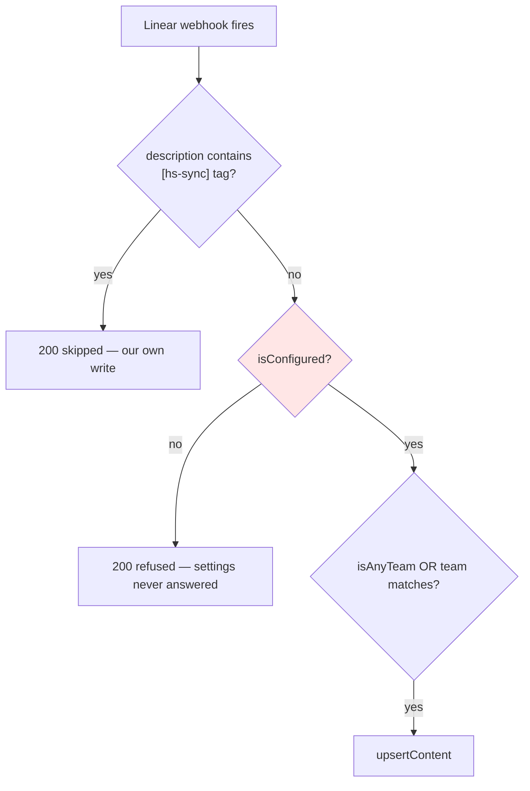

## 🎬 YouTube Episode Guide: One Brain, Two Machines — Shared Instructions That Make Your AI Write Tests

**🎯 Core Learning Objective:**
"By the end of this video, you will know how to make your AI coding assistant behave the same way on every machine you use — by moving the hard-won rules out of chat history and into files the repo carries, so the next session starts where the last one ended instead of relearning it."

**⏱️ The 10-Minute Script Outline:**

*   **Hook & Demo (0:00 - 1:00):**
    Two machines, one repo. On machine A, the AI had spent a morning writing failing tests before every fix. On machine B, it shipped **333 lines of new settings code with zero tests** — and the test count sat at exactly 999 before and after.

    The hook: *"Same model. Same repo. Same person. Completely different standards — because everything the first machine learned lived in a chat window the second machine never saw."*

    Show the `CLAUDE.md` before: one rule, about generating video guides. Nothing about testing, nothing about the traps. Then show it after, and run `git log --stat` to show the coverage gap it was written to close.

*   **The Architecture (1:00 - 3:00):**
    Draw the distinction that makes this work: **session memory vs. repo memory.**

    Session memory is what the assistant learned this conversation. It is excellent and it is gone — it does not survive a new machine, a cleared context, or a colleague.

    Repo memory is a file that is checked in. `CLAUDE.md` is loaded automatically at the start of every session in that directory, on every machine, forever.

    So the test is simple: *if losing this fact would cost a day, does it live in a file git tracks?* If it only lives in a chat, it is already lost.

    Then the second half: **write rules as evidence, not as preferences.** "Please write tests" is ignorable. "The user list was truncated at 250 of 452 and the person configuring the portal was #347 — that shipped because this file had no coverage" is not, because it explains the cost. Show both phrasings side by side.

*   **Step-by-Step Implementation (3:00 - 8:00):**

    **Step 1 — Find what only exists in the chat (3:00 - 4:00).**
    Open `CLAUDE.md`. It has one rule. Then walk the last week of commits and pull out every fact that cost real time: pagination caps, a sentinel that is truthy, HubSpot dropping nulls, deploys that print DONE while still building. None of them are in the repo. That list *is* your instructions file.

    **Step 2 — Write rules with their receipts (4:00 - 5:30).**
    Open the new `CLAUDE.md`. Show the "Tests are not optional" section, and specifically the paragraph naming five real bugs and what they had in common. Point out the concrete, checkable clauses — "a bug fix with no failing test first is not finished", "`npm run validate` must exit 0" — versus vague encouragement.

    **Step 3 — Write down the testing technique, not just the requirement (5:30 - 6:30).**
    The rule "write tests" is not enough if the tests are written badly. Show the three clauses that encode *how*: mock by intent rather than call order, mock what the API actually returns, and always keep a control case. Explain the control: the scenario that already worked, green before and after, proving the fix did not break the normal path.

    **Step 4 — Give the architecture a home (6:30 - 8:00).**
    Open `docs/ARCHITECTURE.md`. Show the Mermaid flowchart of the Linear-to-HubSpot path — every guard on it exists because something got through. GitHub renders Mermaid natively, so a checked-in diagram is a diagram both machines and every reviewer can see. Contrast with the flowchart that previously existed only as a chat artifact: real work, invisible to the other machine.

*   **Testing & Wrap-up (8:00 - 10:00):**
    Prove it works the honest way: start a fresh session on the second machine and ask it to fix something small. It should propose a failing test first, without being told. That is the whole return on this file.

    Three takeaways:
    1. **If it only exists in a chat window, it does not exist.** Anything worth a day belongs in a tracked file.
    2. **Rules need receipts.** Name the bug the rule would have prevented, and the rule stops being negotiable.
    3. **Diagrams belong in the repo.** Mermaid renders on GitHub — a flowchart in a doc is worth more than a prettier one in a conversation.

**💻 Screen-Ready Code Snippets:**

**The gap, in one command**
```bash
# 333 lines of new behaviour across two files...
git diff --stat <last-known-good> origin/develop

# ...and nothing under __tests__ touched.
git log --oneline --name-only <last-known-good>..origin/develop \
  --no-merges -- 'src/**/__tests__/**'
```

**A rule with its receipts — the part that makes it stick**
```markdown
## Tests are not optional

**Every behaviour change ships with a test. Every bug fix starts with a
failing test.** Write the test, watch it fail, then fix it — a fix you
never saw fail is a guess.

This is the rule because of what happened without it. The Linear teams
list was truncated at 50 of several hundred, the user list at 250 of 452,
the project list at 250 of 1,592, the `'any'` sentinel sent lookups to a
team that does not exist, and the webhook synced every team on an
unconfigured portal. Every one of them reached a live portal, and every
one was in a file with no coverage.
```

**Encoding *how* to test, not just *that* you must**
```markdown
- Mock by **intent, not call order** — route a fetch mock on the URL or
  the query it carries. Order-based mocks break the moment a request is
  added.
- Mock what the API **actually** returns. Linear answers a bogus id with
  a null node, not an HTTP error; mock a throw and the bug hides behind
  the catch.
- Keep a **control** in the test file: the case that was already correct.
  It is what proves a fix did not break the ordinary path.
```

**A checked-in flowchart, rendered by GitHub**
````markdown

````

**The traps, stated so a cold session can act on them**
```markdown
- **Paginate every Linear connection.** Linear defaults a connection to
  50 and caps a page at 250. One request is a page, not a set.
- **Never sort a list you have not finished fetching.** Truncate to 250
  and sort alphabetically and it reads as a complete A–Z sweep with the
  middle missing.
- **Never let an id reach the screen as a label.** A `Select` whose
  `value` matches no option renders the raw UUID and flags the field
  invalid.
- **Primary display properties cannot be cleared.** Read sentinels
  through their named predicate, never a truthiness check — `'any'` is
  truthy.
```
